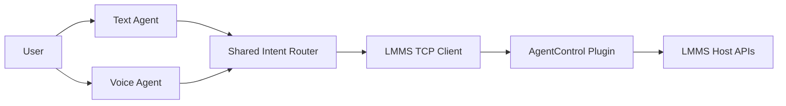

# Architecture

## Components

### AgentControl plugin

The plugin lives inside LMMS and owns the command execution boundary. It exposes a small command UI and a localhost socket on `127.0.0.1:7777`.

### Text agent

The text agent is a thin CLI wrapper. It normalizes natural language into stable LMMS command strings and sends them to the plugin.

### Voice agent

The voice agent is a local bridge. It can accept a transcript directly or call an external `whisper.cpp` binary to transcribe an audio file before sending the resulting command to LMMS.

### Shared intent router

The current router is deliberately small. It handles synonym cleanup and command normalization without coupling the repo to a single model provider. This is the correct place to deepen intent planning later.

## Integration strategy

This repo does not vendor the full LMMS source tree. Instead it keeps:

- the plugin source
- a minimal host-support patch set for LMMS
- scripts that apply the integration to a normal LMMS checkout
